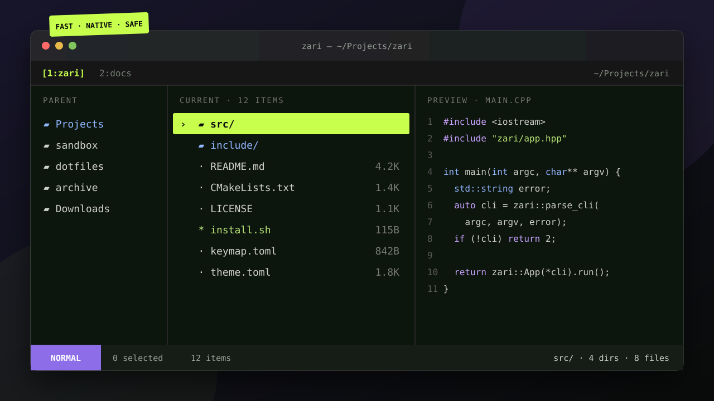

# Zari

**A fast, keyboard-driven terminal file manager for Linux, written in C++20.**

> Zari is inspired by modern terminal file managers but is an independent C++ implementation.

<div align="center">
  
</div>

<p align="center"><sub>Illustrated preview — exact colors and glyphs depend on your terminal and active theme.</sub></p>

Zari focuses on predictable filesystem behavior, a clean three-pane interface, and useful defaults that can be overridden without copying a complete configuration. It has no plugin or scripting system.

## Features

- Wide-character ncurses UI with parent, current, and preview panes
- Vim-style navigation, scrolling, history, tabs, selection, and multi-key chords
- Natural/alphabetical/extension/size/time/random sorting
- Text, directory, binary, symlink, and metadata previews
- Copy, cut, collision-safe paste, rename, create, trash, and permanent delete
- Incremental fuzzy find and native recursive filename search
- Layered TOML configuration, keymap, built-in themes, and runtime reload
- XDG-aware config/state paths and safe terminal restoration through RAII

## Requirements and installation

Linux, CMake 3.20+, a C++20 compiler, and ncursesw development headers are required. On Debian/Ubuntu: `sudo apt install cmake g++ libncursesw5-dev`.

```sh
cmake -S . -B build -DCMAKE_BUILD_TYPE=Release
cmake --build build
ctest --test-dir build --output-on-failure
sudo cmake --install build
```

The executable installs to `${CMAKE_INSTALL_PREFIX}/bin/zari`; themes install below `${CMAKE_INSTALL_PREFIX}/share/zari/themes`. Run `zari`, `zari .`, or `zari /some/path`.

## Keyboard shortcuts

`j/k` move, `h/l` leave/enter, `gg/G` top/bottom, `Space` select, `y/x/p` copy/cut/paste, `d/D` trash/delete, `r` rename, `a/A` create file/directory, `.` hidden files, `/` incremental find, `f` recursive filename search, `tt` new tab, `[`/`]` switch tabs, `Ctrl-w` close tab, `?` help, `R` reload, and `q` quit. The help overlay reflects active bindings.

## Configuration

Files are read from `$ZARI_CONFIG_HOME`, then `$XDG_CONFIG_HOME/zari`, then `~/.config/zari`. Missing files are fine.

```toml
[manager]
show_hidden = false
sort_by = "natural"
directories_first = true
layout = [1, 3, 2]

[preview]
enabled = true
max_file_size = 10485760
tab_size = 4

[theme]
name = "catppuccin-mocha"
```

Use `--config PATH` for an alternate main file and `--theme NAME` for a one-run theme choice. Zari configurations are its own format and are not compatible with Yazi configurations.

### Custom keybindings

```toml
[[manager.bind]]
keys = ["g", "d"]
action = "cd"
arg = "~/Downloads"
description = "Go to Downloads"
```

### Themes

Built-ins: `default`, `catppuccin-mocha`, `gruvbox-dark`, `dracula`, `nord`, and `tokyo-night`. Override individual styles in `theme.toml` with hex or ANSI colors and `bold`, `italic`, `underline`, or `dim` flags. Presets use the commonly published palettes associated with their respective community themes; names belong to their projects.

## Search dependencies

Incremental and recursive filename searches are native. Content-search UI integration with `rg` and richer search-result navigation are roadmap work; Zari never executes files for previewing.

## Architecture

`App` owns the event loop, `Ui` owns rendering, `Manager` coordinates independent `Tab` state, and focused modules handle configuration, themes, keymaps, filesystem operations, previews, search, and background tasks. Ownership is RAII-based and filesystem calls avoid shell interpolation.

## Roadmap

Search-result views, `rg` integration, cancellable progress dialogs for large operations, bulk rename, open-with rules UI, image protocols, syntax highlighting, and more metadata columns.

## Troubleshooting

- Garbled UI: verify a UTF-8 locale and a terminal with Unicode support.
- No colors: check `$TERM` and terminal color capability.
- Config warning: press `R` after correcting the named file; the last working configuration is retained on invalid reload.
- Open fails: ensure `xdg-open` is installed or configure `[open] default`.

## Documentation and website

The repository wiki lives in [`docs/wiki`](docs/wiki/README.md). A deploy-ready static Next.js website, including browsable documentation, lives in [`site`](site/README.md).
